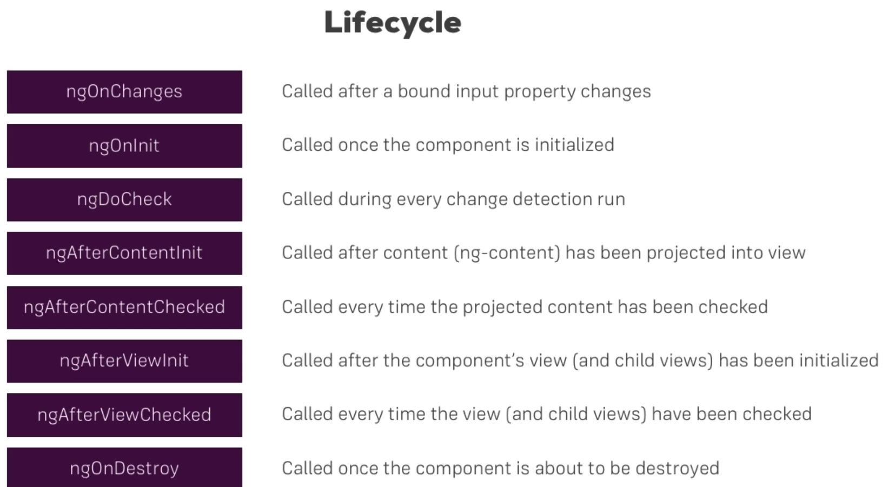

# Angular

Angular is a popular framework used to create reactive single-page applications (SPAs). SPAs provide a seamless user experience by manipulating the Document Object Model (DOM) within a single HTML document.

## Angular Versions

- **AngularJS (Version 1):** The original version of Angular, which was completely rewritten as Angular 2 (Version 2).
- **Angular (Version 2+):** All versions of Angular after 2, including 4, 5, 6, 7, 8, and 9. These versions frequently introduce small improvements and maintain backward compatibility.

This guide focuses on Angular (Version 2 to 9), and knowledge of Angular 2 is generally applicable to the later versions.

## Angular CLI (Command Line Interface)

Angular CLI is the recommended way to create Angular projects. It optimizes files for deployment and simplifies project setup.

## Why Node.js is Required?

Node.js is necessary for several reasons:

1. It is used by the CLI for bundling and optimizing Angular projects.
2. It provides npm (Node Package Manager) for managing project dependencies, including the Angular framework and other libraries.

## Setting Up an Angular Project (Assuming Node.js is Installed)

1. Install Angular CLI globally:
```javascript 
npm install -g @angular/cli 
```
2. Create a new Angular project:
```js
ng new my-dream-app
```
3. Change directory to your project:
```js
cd my-dream-app
```
4. Start a development server:
```js
ng serve
```
To ensure you have the latest CLI version, use the following command:
```js
npm install -g @angular/cli@latest
```


If you're using Windows, run these commands as an administrator.

## TypeScript in Angular

Angular uses TypeScript, which is a superset of JavaScript (JS). TypeScript provides benefits such as early error detection, shorter syntax, and more features than traditional JavaScript.

- **ES5:** Traditional JavaScript supported by all browsers but may lead to runtime issues.
- **ES6/ES2015:** Enhanced JavaScript with new functionalities, often preferred by developers.
- **TypeScript:** A superset of JS that aids in debugging and offers more features. It's highly recommended for larger projects and teams.

## ECMAScript (ES) and JavaScript

ECMAScript is a scripting language standard that JavaScript follows. Netscape approached ECMA for JavaScript standardization, resulting in the name "ECMAScript" for JavaScript.

## Why "JavaScript"?

JavaScript was initially called "LiveScript," but Netscape changed it to "JavaScript" to compete with Microsoft's "Java." The name change occurred during the standardization process with ECMA. The name "JavaScript" is licensed under Oracle.

## TypeScript

TypeScript is similar to vanilla JavaScript but with additional functionality. It cannot run directly in browsers, so it's transcompiled to JavaScript using tools like the Angular CLI.

### TypeScript Features

- Classes
- Strongly Typed Interfaces
- Decorators
- Type Casting

TypeScript is an object-oriented programming language developed by Microsoft. It helps identify and rectify problems during development, making it suitable for large projects and teams.

TypeScript code is transcompiled for execution, offering benefits such as easy debugging and consistency, which are particularly useful in Angular applications.

# Adding Bootstrap to an Angular Project

## Option 1: Using npm install

To add Bootstrap to your Angular project using npm, follow these steps:

1. Install Bootstrap by running the following command:
```js
npm install bootstrap@3
```
- In your `angular.json` file, under the `build` section, add Bootstrap to the styles array:
```typescript
"styles": [
  "src/styles.css",
  "node_modules/bootstrap/dist/css/bootstrap.min.css"
]
```
## Option 2: Using CDN
- You can also use Bootstrap via CDN by adding the following line to your HTML file:

```html
<link rel="stylesheet" href="https://maxcdn.bootstrapcdn.com/bootstrap/3.4.1/css/bootstrap.min.css">
```
## How Angular Runs with `ng serve`

- When you run `ng serve`, Angular serves the `index.html` file as the entry point.
- The `index.html` file contains scripts inserted by the Angular CLI during compilation.
- Angular CLI bundles JavaScript files and inserts them into `index.html`.
- `<app-root></app-root>` is a custom Angular component and not standard HTML.
- The `main.ts` file is the first to run and calls `platformBrowserDynamic().bootstrapModule(AppModule)` to bootstrap the Angular application.
- `AppModule` is defined in `app.module.ts` and specifies which component to `bootstrap` with the bootstrap property.

## Angular Components

- Components in Angular are building blocks with their own logic.
- They help organize and debug applications, reducing repetition.
- Components are created using the `@Component` decorator.
- Here's an example of creating a component manually:
```typescript
import { Component } from "@angular/core";

@Component({
  selector: "app-server",
  templateUrl: "./server.component.html",
})
export class ServerComponent {}
```
## Creating a Component Manually (3 Steps)
1. Create `server.component.ts` and `server.component.html`.
2. Include the component in the `declarations` array of the app module.
3. Mount the component in the required component's template.

## Generating a Component Automatically
You can generate a component automatically using the Angular CLI with either of the following commands:
```angularjs
ng generate component servers
```
OR

```angularjs
ng g c servers
```
This command generates the necessary files and folders for the component.

## Additional Notes
- It's recommended to name components with the "component" suffix to avoid naming conflicts.
- `.spec.ts` files are for testing purposes and can be deleted if not needed.

# Component Templates (Required in Components)

When creating Angular components, you must provide a template for defining the component's HTML structure. You have two options for specifying the template:

1. **Inline Template:**
   You can include the template directly within the component metadata using the `template` property. Here's an example:

   ```typescript
   @Component({
     selector: 'app-servers',
     template: `
       <p>Here it is</p>
       <app-server></app-server>
       <app-server></app-server>
     `,
     styleUrls: ['./servers.component.css']
   })
1. **External Template:**
   Alternatively, you can specify an external HTML file as the template using the `templateUrl` property. The template is then loaded from that file.
## Using Styles in Components
You can also include styles (CSS) in your Angular components. There are two ways to do this:

1. **Using styleUrls:**
   You can link external CSS files to your component using the `styleUrls` property in the component metadata. For example:
```typescript
@Component({
  selector: 'app-root',
  templateUrl: './app.component.html',
  styleUrls: ['./app.component.css']
})
```

   You can define styles directly within the component metadata using the `styles` property. 
   This is useful for small, component-specific styles. Here's an example:
```typescript
@Component({
  selector: 'app-root',
  templateUrl: './app.component.html',
  styles: [
    `
    h3 {
      color: blue;
    }
    `
  ]
})
```
Note that you can't use both `styleUrls` and `styles` simultaneously in the same component.

## Selector Types
Selectors in Angular define how components are identified and used in your templates. There are three types of selectors:

1. **Element Selector:**
   The most common selector type is based on HTML element names. For example, if you use `<app-server>` in your template, you define the component with an element selector like this:
```typescript
@Component({
  selector: 'app-server',
  // ...
})
```
2. **Attribute Selector:**
   You can also use attribute-based selectors. This means you add a custom attribute to your HTML element and select components based on that attribute. For example:
```html
<div app-servers></div>
```
And in your TypeScript file:
```typescript
@Component({
  selector: '[app-servers]',
  // ...
})
```
3. **Class Selector:**
   Components can also be selected based on their class. To use class-based selectors, you add a class to your HTML element and select components based on that class. For example:
```html
<div class="app-server"></div>
```
In your TypeScript file:
```typescript
@Component({
  selector: '.app-server',
  // ...
})
```
Note: Selectors cannot be ID-based and cannot include pseudo-selectors.

# Understanding Data Binding in Angular

## String Interpolation

In Angular, you can use string interpolation to output data to the user interface (UI) using double curly braces `{{ }}`. This allows you to display variables and even call functions in your HTML templates.

```typescript
// component.ts
export class ServerComponent {
    serverId: number = 10;
    serverName: string = "nginx";
}

// component.html
<p>Name of Server with id {{ serverId }} is {{ serverName }}</p>
```
## Property Binding
Property binding allows you to bind a property of an HTML element to a variable in your TypeScript code using square brackets `[ ]`.

```typescript
// component.ts
export class ServerComponent {
    isButtonDisabled: boolean = true;

    constructor() {
        setTimeout(() => {
            this.isButtonDisabled = false;
        }, 3000);
    }
}

// component.html
<button [disabled]="isButtonDisabled">Add Server</button>
```
## Event Binding
Event binding allows you to react to events such as clicks by binding a function to an event in your HTML using parentheses `( )`.
```typescript
// component.ts
export class ServerComponent {
    onServerClick = () => {
        this.serverStatus = "Server Created Successfully";
    }
}

// component.html
<button (click)="onServerClick()">Add Server</button>
```
## Input Event Binding
You can also use input event binding to capture and react to input events from form elements.

```typescript
// component.ts
export class ServerComponent {
    serverName = "";

    onServerNameChange(event: Event) {
        this.serverName = (event.target as HTMLInputElement).value;
    }
}

// component.html
<input type="text" (input)="onServerNameChange($event)" />
```
## Two-Way Binding
Two-way binding allows you to both display and update a variable's value in the UI. To use it, you'll need to import `FormsModule` in your module.
```typescript
// app.module.ts
import { NgModule } from '@angular/core';
import { FormsModule } from "@angular/forms";

@NgModule({
    imports: [
        BrowserModule,
        FormsModule // FormsModule is needed for ngModel Directive
    ],
})
export class AppModule { }
```
```html
<!-- component.html -->
<input type="text" [(ngModel)]="serverName" />
<p>{{ serverName }}</p>
```
# Directives in Angular

Directives are instructions in the DOM.

- The `@Component` we write is also a directive that provides instructions to our component.
- For example, `appTurnGreen` is a directive that can turn the background green.

## Structural Directive

Structural directives change the structure of the DOM conditionally. They are denoted by an asterisk `*`.

```html
<div class="text-danger" *ngIf="savedUsername">
    Username saved, {{ savedUsername }}
</div>
```
To use an `else` condition with `*ngIf`, you can define a template block using `ng-template`.
```html
<div class="text-danger" *ngIf="savedUsername; else noUsername">
    Username saved, {{ savedUsername }}
</div>
<ng-template #noUsername>
    <p>
        Username doesn't exist!
    </p>
</ng-template>
```
## Attribute Directive
Attribute directives modify the behavior or appearance of an element. For example, `ngStyle` and `ngClass` are attribute directives.
```html
<p [ngStyle]="{ backgroundColor: getStatusColor(), color: 'white' }">
    User Status: {{ userStatus }}
</p>
```
When using `ngStyle`, make sure to put quotes around property names with hyphens or use camel case.
```html
<p [ngClass]="{ online: userStatus === 'online' }">
    User Status: {{ userStatus }}
</p>
```
## View Encapsulation in Angular
Angular uses view encapsulation to scope CSS styles to a component. It does this by injecting random strings into element tags and matching those strings in the CSS.

```html
<p _ngcontent-icm-c42>Hey, this is blue color</p>
```
## Components and Data Binding
To send data from a parent component to a child component, you can use custom property binding.
```html
<app-child-component [elements]="parentElements"></app-child-component>
```
In the child component, define the input property using `@Input`.
```typescript
@Input() elements: any[];
```
To send data from a child component to a parent component, you can use custom event emitters.
```typescript
@Output() serverCreated = new EventEmitter<{ type: string, name: string, content: string }>();
@Output() bluePrintCreated = new EventEmitter<{ type: string, name: string, content: string }>();
```
In the child component, emit these events with data.
```typescript
this.serverCreated.emit({
  type: 'server',
  name: this.newServerName,
  content: this.newServerContent
});
```
In the parent component, listen for the custom events and handle the data.

```html
<app-cockpit
  (serverCreated)="addNewServer($event)"
  (bluePrintCreated)="addNewServer($event)"
></app-cockpit>
```
```typescript
addNewServer(server: { type: string, name: string, content: string }) {
  this.serverElements.push(server);
}
```
## Important Note
Using `@Input()` and `@Output()` for simple cases is fine. However, for complex scenarios involving multiple components and data transfer, consider other approaches for better maintainability.

# View Encapsulation in Angular

In Angular, each element is given a default auto-generated attribute, and CSS uses these attributes to select the correct element.

For example, an element like this:
```html
<p _ng_generate_id_1>Hey, this is a paragraph</p>
```
Is transformed in CSS like this:
```css
p[_ng_generate_id_1] {
    /* Styles */
}
```

## Changing Encapsulation
You can change the encapsulation type in Angular components using the `encapsulation` property in the component decorator:
```typescript
@Component({
  selector: 'app-root',
  templateUrl: './app.component.html',
  styleUrls: ['./app.component.css'],
  encapsulation: ViewEncapsulation.Emulated // Default encapsulation type
})
```
- `ViewEncapsulation.Emulated`: This is the default encapsulation type, and it generates auto-generated attributes.
- `ViewEncapsulation.None`: Use this if you don't want the auto-generated IDs. The CSS will be applied globally across the entire application.
- `ViewEncapsulation.ShadowDom`: Works only on supported browsers and uses the Shadow DOM for encapsulation.

## Using Local References
Local references in Angular templates are created using `#` followed by a reference name. These references can be used to access elements in the template.
```html
<input type="text" class="form-control" #serverName>
<button class="btn btn-primary" (click)="onAddServer(serverName)">Add Server</button>
```
In the component, you can use the reference to fetch the element's value:

```typescript
onAddServer(serverName: HTMLInputElement) {
    console.log(serverName.value); // Accessing the value of the input element
}
```

## Getting Template Elements in the Component
You can use `@ViewChild` to get a reference to an element defined in the template from within the component.
```typescript
@ViewChild("serverContent") serverContent: ElementRef;
```
This allows you to interact with the template element in your component code.

## Sending Template to Child Component
To send a template from a parent component to a child component, you can use the `<ng-content></ng-content>` element in the child's template. The content provided between the opening and closing tags of the child component will be passed as the template to the child.

```html
<app-server>Wakka wakka</app-server>
```
Inside the child component's template:
```html
<ng-content></ng-content>
```
This makes the child component ready to accept and display custom templates.

# Component Lifecycle Hooks



Angular provides a series of lifecycle hooks that you can use to tap into the lifecycle of a component. The most commonly used hooks are:

- `ngOnChanges(changes: SimpleChanges)`: Called when any input property of the component changes.
- `ngOnInit()`: Called when the component is initialized.
- `ngDoCheck()`: Called whenever Angular checks for changes.
- `ngAfterContentInit()`: Called once after the content (inside <ng-content>) is initialized.
- `ngAfterContentChecked()`: Called after each check of the content.
- `ngAfterViewInit()`: Called once after the view is initialized.
- `ngAfterViewChecked()`: Called after each check of the view.
- `ngOnDestroy()`: Called when a component is about to be destroyed.

**Note**: It's important to be cautious about adding side effects in certain hooks like `ngDoCheck()` to prevent performance issues.

# Angular Directives

Angular provides two types of directives:

1. **Attribute Directive**: These look like normal HTML attributes and change the appearance or behavior of an element. Examples include `ngClass` and `ngStyle`.

2. **Structural Directive**: These look like normal HTML attributes but have an asterisk `*` before them. They add or remove elements in the DOM. Examples include `*ngFor` and `*ngIf`.

Note: You cannot use both `*ngFor` and `*ngIf` on a single element.

## Creating a Custom Attribute Directive

To create a custom attribute directive, follow these steps:

1. Create a TypeScript file for the directive in a folder.

2. Define the directive using the `@Directive` decorator.

```typescript
import { Directive, ElementRef, OnInit } from "@angular/core";

@Directive({
    selector: '[basic-highlight]'
})
export class BasicHighlight implements OnInit {
    constructor(private elementRef: ElementRef) { }
    
    ngOnInit() {
        this.elementRef.nativeElement.style.backgroundColor = "pink";
    }
}
```
1. Angular will inject the element reference into the constructor of the directive, allowing you to manipulate the element.
2. You can now use this directive in your template by including its selector in an element.

```html
<li basic-highlight>{{ num }}</li>
```

## Avoid Direct Element Access
It's recommended not to access element properties directly in the component, as it may not work in server-side rendering. Instead, use the Renderer.

## Using Renderer
The Renderer helps you avoid direct element access and is the best practice.

```typescript
import { Directive, ElementRef, Renderer2, OnInit } from '@angular/core';

@Directive({
  selector: '[appBasicBetterHighlight]'
})
export class BasicBetterHighlightDirective implements OnInit {
  constructor(private elementRef: ElementRef, private renderer: Renderer2) { }

  ngOnInit() {
    this.renderer.setStyle(this.elementRef.nativeElement, "background-color", "blue");
  }
}
```

## @HostListener and @HostBinding
You can listen to events and bind properties directly within the directive.

```typescript
import { Directive, ElementRef, HostListener, HostBinding } from '@angular/core';

@Directive({
  selector: '[appBasicBetterHighlight]'
})
export class BasicBetterHighlightDirective {

  @HostBinding("style.backgroundColor") backgroundColor: string = "transparent";

  @HostListener("mouseenter") mouseEnter(event: Event) {
    this.backgroundColor = "red";
  }

  @HostListener("mouseleave") mouseLeave(event: Event) {
    this.backgroundColor = "transparent";
  }
}
```

## Passing Parameters to Directives
You can pass parameters to directives using `@Input()`.
```typescript
import { Directive, Input } from '@angular/core';

@Directive({
  selector: '[appBasicBetterHighlight]'
})
export class BasicBetterHighlightDirective {

  @Input() defaultBackgroundColor: string;
  @Input() hoverBackgroundColor: string;

  ngOnInit() {
    this.backgroundColor = "yellow";
  }
}
```
Use the directive in your template and pass the parameters using property binding.

```html
<div [appBasicBetterHighlight]="'green'">
  Hey, this is a better directive usage.
</div>
```

## Structural Directives
Structural directives use the asterisk `*` and conditionally change the structure of the DOM. Examples include `*ngIf` and `*ngFor`.
### Creating a Custom Structural Directive
Creating a custom structural directive is similar to creating an attribute directive, but you'll use `*` in the template.
```typescript
import { Directive, Input, TemplateRef, ViewContainerRef } from '@angular/core';

@Directive({
  selector: '[appUnless]'
})
export class UnlessDirective {

  @Input() set appUnless(condition: boolean) {
    if (condition) {
      this.vcRef.createEmbeddedView(this.templateRef);
    } else {
      this.vcRef.clear();
    }
  }

  constructor(private templateRef: TemplateRef<any>, private vcRef: ViewContainerRef) { }
}
```
Use the custom structural directive in your template with an asterisk `*`:
```html
<div *appUnless="onlyOdd">
  <!-- Content here will be conditionally displayed -->
</div>
```

## ngSwitch Directive
The `ngSwitch` directive allows you to handle multiple `*ngSwitchCase` conditions efficiently.
```html
<div [ngSwitch]="luckyNum">
  <div *ngSwitchCase="1">Content for case 1</div>
  <div *ngSwitchCase="2">Content for case 2</div>
  <!-- Add more cases as needed -->
</div>
```
# Angular Services
In Angular, services are used to provide shared functionality, data, or utility functions across multiple components. Services are typically injected into components, and Angular takes care of creating and managing service instances.
## Creating a Service

To create a service, you can use the Angular CLI or manually create a TypeScript file. For example, to create a logging service using the CLI:

```bash
ng generate service logging
```
A simple class exported as a TypeScript module is also considered a service.

```typescript
export class LoggingService  {
    logIt(accountStatus: string) {
        console.log('A server status changed, new status: ' + accountStatus);
    }
}
```

## Using a Service
To use a service in an Angular component, follow these steps:

1. **Import the Service**: Import the service class in your component.
2. **Declare the Service**: Declare the service in the providers array of the component or use Angular's modern syntax for providing services.
3. **Inject the Service**: Inject the service into the component's constructor.
4. **Use the Service**: Use the service's methods or properties within the component.

```typescript
import { Component } from '@angular/core';
import { LoggingService } from '../services/logging.service';

@Component(
  providers: [LoggingService] // Declare the service here
})
export class NewAccountComponent {
    constructor(private logService: LoggingService) {} // Inject the service here
    this.logService.logIt(accountStatus) // Use the service here
  }
}
```
## Role of Services
Services play a crucial role in Angular applications, primarily for sharing data between components and centralizing business logic. You can use services to manage and store data in a single place, making it easier to maintain and share information between components.

## Hierarchical Injector
Angular uses a hierarchical injector to manage service instances. When you declare a service in the `providers` array of a component, Angular provides the same instance of the service to all child components. However, if you declare the service in a child component's `providers` array, a new instance of the service is created.
- App Module: Provides a single instance application-wide.
- App Component: Provides the same instance to all components within the component hierarchy.
- Any Component: Provides the same instance to the component and all of its child components.

To share a single instance of a service across multiple components, directly use the service without mentioning it in the child component's `providers` array.

## Services in Services
You can also use services within other services. To do this, make sure to declare the services in the `providers` array of the app module to ensure they are available application-wide.

## Cross-Component Communication with Services
Services can be used for cross-component communication. Instead of using event emitters and property binding, you can use services to share data between components that are not directly connected.

Here's an example of using an event emitter in a service to facilitate cross-component communication:

```typescript
import { Injectable, EventEmitter } from "@angular/core";

@Injectable()
export class AccountService {
  statusEmitter = new EventEmitter<string>();
}
```

You can then emit data from one component and subscribe to it in another component:

```typescript
// Component 1
this.accountService.statusEmitter.emit(status);

// Component 2
this.accountService.statusEmitter.subscribe((status) => console.log("Received status: ", status));
```

## Services in Angular 6+
In Angular 6+, you can provide application-wide services in a different way. Instead of adding a service class to the `provider`s array in `AppModule`, you can use the following config directly in the service:
```typescript
@Injectable({ providedIn: 'root' })
export class MyService { ... }
```
This is equivalent to the traditional approach and offers better performance and code optimization.

# Routing
Routing in Angular enables the creation of single-page applications (SPAs) where only the URL changes, and parts of the DOM are updated without refreshing the entire page.

```typescript
import { RouterModule, Routes } from '@angular/router';

const routes: Routes = [
  { path: "", component: HomeComponent },
  { path: "users", component: UsersComponent },
  { path: "servers", component: ServersComponent },
];

@NgModule({
  imports: [
    BrowserModule,
    FormsModule,
    RouterModule.forRoot(routes) // Registering the routes
  ],
  declarations: [
    // ...
  ],
  providers: [
    ServersService
  ],
  bootstrap: [AppComponent]
})
export class AppModule { }
```
Now, add the `<router-outlet></router-outlet>` directive in your HTML template to load the route components.

```html
<div class="row">
  <div class="col-xs-12 col-sm-10 col-md-8 col-sm-offset-1 col-md-offset-2">
    <router-outlet></router-outlet> <!-- Load the routes here! -->
  </div>
</div>
```
## Navigating with `routerLink`

Instead of using `href` for navigation, use the `routerLink` directive to navigate between routes. It ensures that the application's state is preserved.
```html
<li role="presentation"><a routerLink="/">Home</a></li>
<li role="presentation"><a routerLink="/servers">Servers</a></li>
<li role="presentation"><a [routerLink]="['/users']">Users</a></li>
```
You can also use it programmatically in TypeScript files:

```typescript
import { Router } from '@angular/router';

constructor(private router: Router) {}

buttonClicked() {
  this.router.navigate(['/servers']); // Navigating programmatically
}
```

## Handling Query Parameters and Fragments
To work with query parameters and fragments, you can use both templates and TypeScript.
```html
<a [routerLink]="['/servers']" [queryParams]="{ final: true }" fragment="loading">Servers</a>
```

```typescript
serverButtonClicked() {
  this.router.navigate(['/servers'], {
    queryParams: { final: true },
    fragment: 'loading'
  });
}
```

## Nested Routing
To create nested routes, define child routes within a parent route using the `children` property.

```typescript
const routes: Routes = [
  { path: "servers", component: ServersComponent, children: [
    { path: ":id", component: ServerComponent },
    { path: ":id/edit", component: EditServerComponent }
  ]}
];
```

Inside the parent component's template (e.g., ServersComponent), add another `<router-outlet></router-outlet>` to load child route components.

## Route Guards
Route guards help protect routes by performing checks before allowing access. Implement the `CanActivate` interface to create route guards.

```typescript
@Injectable()
export class AuthGuardService implements CanActivate {
  constructor(private auth: AuthService, private router: Router) {}

  canActivate(
    route: ActivatedRouteSnapshot,
    state: RouterStateSnapshot
  ): Observable<boolean> | Promise<boolean> | boolean {
    // Perform access check logic here
  }
}
```

Use the canActivate property in your route configuration to apply the guard.

## CanDeactivate Guard
The CanDeactivate guard helps prevent users from leaving a component with unsaved changes. Implement the `CanDeactivate` interface and provide a `canDeactivate` method in your component.

```typescript
@Injectable()
export class CanDeactivateService implements CanDeactivate<CanDeactivateComponent> {
  canDeactivate(
    component: CanDeactivateComponent,
    route: ActivatedRouteSnapshot,
    state: RouterStateSnapshot,
    nextState: RouterStateSnapshot
  ): Observable<boolean> | Promise<boolean> | boolean {
    return component.canDeactivate();
  }
}
```

Apply the CanDeactivate guard in your route configuration to use it.

## Using `data` in Routes
You can include additional data in your routes using the `data` property.

```typescript
{ path: 'page-not-found', component: ErrorPageComponent, data: { message: "Some error occurred" } }
```

Retrieve the data in your component:
```typescript
this.errorMessage = this.route.snapshot.data["message"];
```

## Dynamic Data with Resolve Guard
Resolve guards allow you to fetch data before a component is loaded. Implement the `Resolve` interface to create a resolve guard.
```typescript
@Injectable()
export class ServerResolver implements Resolve<Server> {
  constructor(private serverService: ServersService) {}

  resolve(
    route: ActivatedRouteSnapshot,
    state: RouterStateSnapshot
  ): Observable<Server> | Promise<Server> | Server {
    // Fetch data and return it
  }
}
```
Apply the resolve guard in your route configuration using the `resolve` property. The resolved data is available in the component.

```typescript
{ path: ":id", component: ServerComponent, resolve: { server: ServerResolver } }
```

```typescript
ngOnInit() {
  this.route.data.subscribe((data) => {
    this.server = data["server"];
  });
}
```
# Observables in Angular

Observables in Angular are a powerful way to handle asynchronous data streams. They are used extensively in Angular applications and offer more flexibility than promises.

## Understanding Observables

- A promise represents a single asynchronous value, while an observable can be thought of as a stream of values arriving synchronously or asynchronously over time—a potentially infinite stream.

- Observables have three primary hooks:
   1. **Data received**: When new data is available.
   2. **Error received**: When an error occurs.
   3. **Process completed**: Not always applicable, but it signals the end of the observable stream.

- Observables are not native JavaScript or TypeScript constructs; they are provided by the third-party package "rxjs," which comes bundled with Angular.

## Basic Usage of Observables

```typescript
import { interval, Subscription } from 'rxjs';

export class HomeComponent implements OnInit, OnDestroy {
  private intervalSubscription: Subscription;

  ngOnInit() {
    this.intervalSubscription = interval(1000).subscribe((count) => {
      console.log("Count: ", count);
    });
  }

  ngOnDestroy() {
    this.intervalSubscription.unsubscribe();
  }
}
```

**Note**: Observables can lead to memory leaks if not properly managed. It's essential to unsubscribe from them when they are no longer needed to avoid leaks.

## Creating Custom Observables
You can create custom observables using the `Observable.create` method. Here's an example:

```typescript
const customObservable = Observable.create((observer) => {
  let count = 0;
  setInterval(() => {
    count++;
    observer.next(count); // Send data
  }, 1000);
});
```
You can also handle errors and completion in custom observables:

```typescript
const customObservable = Observable.create((observer) => {
  let count = 0;
  setInterval(() => {
    count++;
    if (count === 2) {
      observer.complete(); // Observer is complete
    }
    if (count === 3) {
      observer.error('Oops, count is 3!'); // Observer gives an error
    }
    observer.next(count);
  }, 1000);
});
```
## Transforming Data with Operators
You can transform the data emitted by an observable using operators. For example, you can use the `map` operator to modify emitted values:
```typescript
const changeObservable = customObservable.pipe(map((data: number) => {
  return 'Point: ' + data;
}));
```

Operators like `map`, `filter`, and others can be used to modify observable data before subscribing to it.
## Subjects

Subjects are a way to both produce and consume values in the observable world. They are similar to Event Emitters but offer more flexibility and optimization.

### Using Subjects
Define a Subject in a service file:
```typescript
import { Injectable } from "@angular/core";
import { Subject } from "rxjs";

@Injectable({ providedIn: 'root' })
export class UserService {
  authEmitter = new Subject<boolean>();
}
```

In a component, use `.next()` to send data:
```typescript
this.userService.authEmitter.next(showText);
```
In another component, subscribe to the subject to receive changes:

```typescript
this.userService.authEmitter.subscribe((value) => {
  // Handle the received value
});
```

Subjects are particularly useful for cross-component communication and provide an alternative to using `@Output` with Event Emitters.

# Forms in Angular


